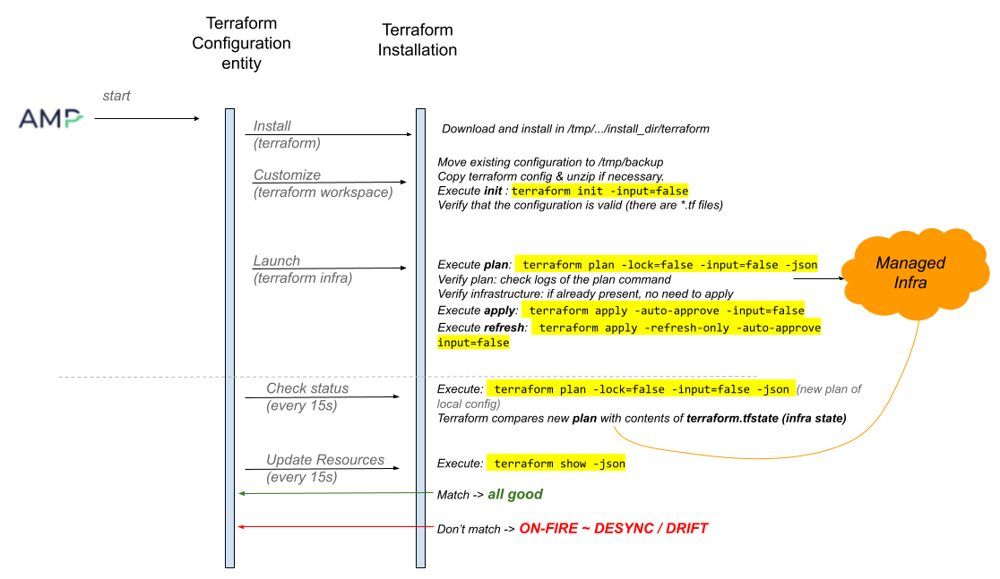

The Apache Brooklyn - Terraform integration allows Terraform configurations, including modules,
to be composed, deployed, managed and governed by Apache Brooklyn.
Brooklyn is able to show, group, and attach sensors effectors and policies to all the
resources created with Terraform.

Popular use cases include:

* Day-Two management of estates including Terraform
* Resilience and DR
* Drift detection and notification or remediation
* Using Terraform tactically (where large TF plans are hard to work with),
  combined with AMP for cleaner lifecycle


## Quick Start Examples

### AWS EC2 Instance using Terraform at the AMP Server

For example, the following blueprint can be used to run
Terraform on `localhost` with a plan that provisions an instance in Amazon EC2 us-east-1 and assigns it an elastic IP:

```yaml
location: localhost
name: Brooklyn Terraform Deployment
services:
- type: terraform
  name: Terraform Configuration
  brooklyn.config:
    tf.execution.mode: ssh
    tf.configuration.contents: |
        resource "aws_instance" "example" {
            ami = "ami-408c7f28"
            instance_type = "t1.micro"
            tags = {
                Name = "brooklyn-terraform-test"
            }
        }

        resource "aws_eip" "ip" {
            instance = "${aws_instance.example.id}"
        }
```

The above assumes your AWS credentials are configured in `~/.aws/` and the command-line `terraform`
works to install them.


### Even Quicker: SNS Topic in AWS using a Terraform Container

If the `cloudsoft/terraform` container is installed and accessible from `kubectl`
(as described below), it can be even easier, as there is no need to use a server:

```yaml
name: Brooklyn Terraform Deployment
services:
- type: terraform
  name: Terraform Configuration
  brooklyn.config:
    tf.configuration.contents: |
        variable "aws_access_key" {}
        variable "aws_secret_key" {}
        provider "aws" {
            access_key = var.aws_access_key
            secret_key = var.aws_secret_key
            region = "us-east-1"
        }

        resource "aws_sns_topic" "my_topic" {
          name = "test-sns-topic"
        }
    tf_var.aws_access_key: ACCESSKEY
    tf_var.aws_secret_key: SECRETKEY
```

With containers of course it is necessary to inject all variables;
this can be done as above, and of course the reference to `SECRETKEY`
can refer to an externalized property (e.g. from Vault).

Variable injection is a powerful way to parameterise and compose terraform blueprints
with other terraform blueprints and other AMP blueprints, as described below.
These can refer to outputs from other blueprints or any AMP sensor, and can be updated
dynamically by policies or human users; drift will automatically be detected and reported. 

The SNS topic is a popular choice simply because it is free and fast to create.  
Typically blueprints are much more complicated, and referenced as a `tf.configuration.url`
pointing at a ZIP, which might contain modules etc.


## Reference

AMP executes various terraform commands and uses their output to decide resource statuses and populate sensors. The following image shows the commands executed by AMP.




### Terraform Setup

AMP needs to be able to run `terraform` to perform the applies and refreshes.
This can be done either:

* Using a container
* Using a process at a server

If using a container, `kubectl` must be accessible to AMP 
[as described elsewhere](https://docs.cloudsoft.io/blueprints/syntax-effectors.html#containereffector),
and the container `cloudsoft/terraform` available to it.
That container should be able to run `terraform`, `curl`, and `unzip`;
a sample [Dockerfile](docker-build/Dockerfile) is available
(download it to its own directory and run `docker build -t cloudsoft/terraform .` in that directory).

To use a process on a server, simply supply an SSH or cloud location.
This should be a Linux or Mac server. If `terraform` is already installed, it will be used,
otherwise it will be installed.
The server where AMP is running can be used by declaring `localhost` as the location
[per these docs](https://docs.cloudsoft.io/locations/reference/#localhost).

In a production deployment, it is recommended either to ensure the persistent volumes 
used by Kubernetes are backed up and shared across AMP failover targets
(because Terraform state is stored on those volumes)
or to configure Terraform to use a hosted service to store its state. 


### Entity Configuration

The entity requires a value for one of the `tf.configuration.contents` and `tf.configuration.url` configuration keys.

* `tf.configuration.contents` allows you to include a plan directly in a blueprint.

* `tf.configuration.url` has the entity load a remote resource at runtime. 
  The resource must be accessible to the Brooklyn server. The resource can be a single `configuration.tf` file or a `*.zip` archive containing multiple `*.tf` files and `terraform.tfvars` file.
  This can be an external URL (e.g. Artifactory or GitHub) or a `classpath://` URL to load from a catalog bundle. 

Other useful configurations:

* `tf.execution.mode` : either `kube` (the default) to use a container via `kubectl` at the AMP server,
  or `ssh` to run `terraform` on a server that AMP will ssh to (such as `localhost` to run terraform at the AMP server)  
* `tf.polling.period` : how often should AMP check the status of the Terraform deployment. Default value is 15s.
* `tf.drift.check` : default value is `true` which means AMP reports drift if Terraform does. Set this to `false` (not recommended) to disable drift checking.
* `tf_var.*` : all configurations prefixed with `tf_var.` are converted to Terraform variables. This is a practical way to avoid using `terraform.tfvars` files and inject the values  directly from the AMP blueprint. Just don't use special characters(e.g. ".") when naming your configurations!
* `version` : set this with the version of Terraform you want AMP to use to manage your deployment. AMP downloads it and installs in a directory that gets deleted when the application is stopped. By default, the version used is the one configured in the current version of `brooklyn-terraform`.
* `tf.search` : when set to `true` AMP looks for the terraform version installed on the location. If found, it uses it to manage the deployment. By default, it is set to `false`.
* `tf.path` :  set this with the terraform cli path on the location to instruct AMP to use it to manage the deployment.

When started the entity installs Terraform and applies the configured plan.


### Terraform Outputs

The Terraform plan's [outputs](https://www.terraform.io/intro/getting-started/outputs.html) are published as Brooklyn sensors prefixed with `tf.output.`. Use this to communicate
information about the infrastructure created by Terraform to other components of the blueprint via Brooklyn's [dependent configuration](https://docs.cloudsoft.io/blueprints/syntax-yaml-reference.html#dsl-commands).

For example, to attach a `TomcatServer` to an AWS security group that was created by a Terraform plan:

```shell

services:

- type: org.apache.brooklyn.entity.webapp.tomcat.TomcatServer
  location:
    jclouds:aws-ec2:us-west-2:
      osFamily: centos
      templateOptions:
        securityGroupIds:
        - $brooklyn:component("tf").attributeWhenReady("tf.output.securityGroupId")
  brooklyn.config:
    launch.latch: $brooklyn:component("tf").attributeWhenReady("service.isUp")
    wars.root: http://search.maven.org/remotecontent?filepath=org/apache/brooklyn/example/brooklyn-example-hello-world-webapp/0.9.0/brooklyn-example-hello-world-webapp-0.9.0.war

- type: terraform
  id: tf
  brooklyn.config:
    tf.configuration.contents: |
        # Credentials are given here for a self-contained blueprint. In practice you
        # would inject the values with an external configuration provider.
        provider "aws" {
            access_key = "..."
            secret_key = "..."
            region = "us-west-2"
        }

        resource "aws_security_group" "allow_all" {
          description = "test-security-group allowing all access"

          ingress {
            from_port = 0
            to_port = 0
            protocol = "-1"
            cidr_blocks = ["0.0.0.0/0"]
          }

          egress {
            from_port = 0
            to_port = 0
            protocol = "-1"
            cidr_blocks = ["0.0.0.0/0"]
          }
        }

        output "securityGroupId" {
            value = "${aws_security_group.allow_all.id}"
        }
```

### Terraform Resources

Each resource that Terraform manages corresponds to an entity represented in AMP as a child of the Terraform Configuration entity.

Resources can be grouped in AMP configuring a`org.apache.brooklyn.entity.group.DynamicGroup`  with a `io.cloudsoft.terraform.predicates.TerraformDiscoveryPredicates` that provided a criteria based on which resources should be grouped(e.g. resource type).

```yaml
name: Apache Tomcat + MySQL on VSphere Demo
services:
- id: tf-tomcat
  type: terraform
  name: Terraform Configuration
  brooklyn.config:
    ...
- type: org.apache.brooklyn.entity.group.DynamicGroup
  name: VSphere Tags
  brooklyn.config:
    dynamicgroup.ancestor: $brooklyn:entity("tf-tomcat")
    dynamicgroup.entityfilter:
      config: tf.resource.type
      equals: vsphere_tag
```

**Note:** The entities corresponding grouping nodes created based on predicates do not update their state in tandem with the Terraform Configuration entity, so if the Terraform deployment is modified and resources are added or removed,

Resources not managed by Terraform, but represent the support on which Terraform creates its own, also called `data resources`, are discovered and grouped under an entity named `Data Resources`.

### Terraform Variables Support

Values for Terraform variables referenced in the configuration can be provided by declaring environment variables in the blueprint using `shell.env`.
The Terraform environment variables should be named according to the specifications in the [official Terraform documentation](https://www.terraform.io/docs/language/values/variables.html#environment-variables).

For example, the following blueprint describes a Terraform deployment with the configuration provided as a single file hosted on an Artifactory server. The AWS credentials values
are provided by a Vault installation using Terraform environment variables. You can declare your own terraform variables like shown below:

```yaml
name: Brooklyn Terraform Deployment With Environment Variables
services:
  - type: terraform
    name: Terraform Configuration
    brooklyn.config:
      tf.configuration.url: https://search.maven.org/remotecontent?filepath=org/apache/brooklyn/instance-with-vars.tf

      shell.env:
        TF_VAR_aws_identity: $brooklyn:external("vault", "aws_identity")
        TF_VAR_aws_credential: $brooklyn:external("vault", "aws_credential")
```

Or you can also use `tf_var.` prefixes Brooklyn configurations:

```yaml
name: Brooklyn Terraform Deployment With Environment Variables
services:
  - type: terraform
    name: Terraform Configuration
    brooklyn.config:
      tf.configuration.url: https://search.maven.org/remotecontent?filepath=org/apache/brooklyn/instance-with-vars.tf
      tf_var.aws_identity: $brooklyn:external("vault", "aws_identity")
      tf_var.aws_credential: $brooklyn:external("vault", "aws_credential")
```

Brooklyn also supports providing a `terraform.tfvars` as remote resource at runtime using `tf.tfvars.url`.

```yaml
name: Brooklyn Terraform Deployment With remote 'terraform.tfvars'
services:
- type: terraform
  name: Terraform Configuration
  brooklyn.config:
    tf.configuration.url: https://search.maven.org/remotecontent?filepath=org/apache/brooklyn/big-config.zip
    tf.tfvars.url: https://[secure-location]/vs-terraform.tfvars 
```

Keep credentials out of your blueprint by using Brooklyn's [external configuration providers](https://docs.cloudsoft.io/operations/externalized-configuration.html).
For example, rather than including the `provider` block in the example above, you might write:
```yaml
    type: terraform
    brooklyn.config:
      aws.identity: $brooklyn:external("terraform", "aws.identity")
      aws.credential: $brooklyn:external("terraform", "aws.credential")

      shell.env:
        AWS_ACCESS_KEY_ID: $brooklyn:config("aws.identity")
        AWS_SECRET_ACCESS_KEY: $brooklyn:config("aws.credential")
        AWS_DEFAULT_REGION: $brooklyn:config("aws.region")
```

And configure the `terraform` provider in `brooklyn.properties`:
```shell
    # Refer to the Brooklyn docs for information on other kind of suppliers.
    brooklyn.external.terraform=org.apache.brooklyn.core.config.external.InPlaceExternalConfigSupplier
    brooklyn.external.terraform.aws.identity=...
    brooklyn.external.terraform.aws.credential=...
```

### Updating an Existing Deployment

AMP facilitates modifying an existing Terraform deployment through effectors and mutable config keys.


### Terraform Backends

Terraform allows the user to store the state file in a centralised location, commonly referred to as Terraform Backend. Setting up a remote
Terraform Backed allows multiple users to access the same state of the architecture and this is a recommended approach when using Terraform.
An example of a blueprint which uses an AWS S3 bucket to store the state file is presented below:

```yaml
name: Brooklyn Terraform Deployment
services:
  - type: terraform
    name: Terraform Configuration
    brooklyn.config:
      tf.configuration.contents: |
        terraform {
            backend "s3" {
                bucket = "..."
                key    = "..."
                region = "eu-west-1"
                access_key = "..."
                secret_key = "..."
            }
        }
        provider "aws" {
            ...
        }

        resource "aws_instance" "demo-vm" {
            ami = "ami-02df9ea15c1778c9c"
            instance_type = "t1.micro"
        }
```

Additionally, having the state file stored remotely, AMP is capable of connecting to an already existing infrastructure. If a backend is specified in the blueprint,
but the infrastructure does not exist or is different from the supplied configuration, Terraform will create the required resources.
However, if the infrastructure has already been provisioned, `terraform plan` command will determine there are no changes to be done and connect the AMP application to allow management of the Terraform architecture.

#### Using the `reinstallConfig` Effector

The Terraform Configuration entity provides an effector named `reinstallConfig`. Invoking this effector causes the Terraform configuration files to be moved to the `/tmp/backup` directory and a set of configuration files to be downloaded from the URL provided as a parameter and copied in the Terraform workspace.
If the `/tmp/backup` directory exists, it is deleted. The URL is expected to point to a `*.zip` archive containing the new configuration files.
If no URL is provided, the effector uses the URL provided as a value for the `tf.configuration.url` when the blueprint is deployed.

This effector is useful when the `tf.configuration.url` points to a dynamic URL, such as a GitHub release
(e.g. `https://github.com/${REPO}/${PROJECT}/releases/latest/download/tf-config.zip`) because it allows updating the Terraform configuration from a remote dynamic source.

**Note:** Invoking the `reinstallConfig` effector will not affect the `*.tfvars` file that is provided using the `tf.tfvars.url` configuration key.

#### Using the Managed Resource effectors

The Managed Resources entities (children of the `TerraformConfiguration`) have the default effectors for a `Startable` type entity, i.e. `start`, `stop` and `restart`.
Currently, these effectors have no functionality for the Managed Resources and are reserved for future use. Invoking any of these effectors will have no effect on the entity.

#### Customizing Terraform Variables Values Using Brooklyn Configurations

AMP allows injection of values for Terraform Variables using `brooklyn.config` and modifying those values after a Terraform configuration has been applied.

In the following blueprint, a Brooklyn parameter named `resourceName` is declared having a property `reconfigurable` set to `true`. This means the value of this parameter can be edited after an application is deployed.
The `resourceName` parameter is configured to have the value `overriddenResourceName` in the `brooklyn.config` section of the Terraform Configuration service.
The value of this parameter is injected into the `TF_VAR_resource_name` environment variable using Brooklyn DSL. Terraform takes this value and uses it for the `resource_name` variable in the configuration.
In this blueprint, it is used as a `Name` tag for the created `aws_instance`.

```yaml
name: Brooklyn Terraform Deployment
services:
  - type: terraform
    name: Terraform Configuration
    brooklyn.config:
      resourceName: overriddenResourceName
      tf.configuration.contents: |
        variable resource_name {
        }

        provider "aws" {
            ...
        }

        resource "aws_instance" "resource1" {
            ami = "ami-02df9ea15c1778c9c"
            instance_type = "t1.micro"
            tags = {
                Name = "${var.resource_name}"
            }
        }  
      shell.env:
        TF_VAR_resource_name: '$brooklyn:config("resourceName")'
    brooklyn.parameters:
      - name: resourceName
        type: string
        reconfigurable: true
        default: defaultResourceName
```

The `resourceName` parameter value can be easily modified via the App Inspector UI in the Terraform Configuration entity's Config Summary Table(its value can also be changed using the `br` CLI, or via the REST API).
Once the variable is modified, a notification of the success/failure of the operation is displayed.
If the new value was accepted, the `tf.plan` sensor displays `{tf.plan.status=DESYNCHRONIZED, <resource change details>}` and AMP and Brooklyn sets the application `ON_FIRE`.
The `tf.plan.status=DESYNCHRONIZED` means the plan that was executed (based on the most recent configuration, that includes the new variable value) no longer matches the infrastructure, so the plan and the infrastructure are not in sync.

The user needs to invoke the `apply` effector for the Terraform Configuration entity to apply the changes of the updated configuration.

In about 15-30 seconds, at the next AMP inspection, if the `apply` effector executed correctly, all entities are shown as `RUNNING` and the `tf.plan` sensor displays  `{tf.plan.message=No changes. Your infrastructure matches the configuration., tf.plan.status=SYNC}`.

### Destroy Operations

A `stop` effector is provided for each entity matching a Terraform managed resource. Under the bonnet this effector has no effect, because its action should be based on the resource type.
Even if implemented, when invoked from AMP, it would leave your deployment in an unpredictable state, depending on the dependencies between the resources.

The recommended way to discard your resources safely is to update the Terraform configuration and invoke the `reinstallConfig`.

Invoking the `destroy` effector of a Terraform Configuration entity destroys the resources, but keeps the configuration accessible via the stopped entity.
Undoing the effect of a `destroy` effector invocation on the Terraform Configuration entity is possible by invoking `reinstallConfig` effector of the Terraform Configuration entity. This recreates the managed resources and the entities matching them.

### Terraform Drift Managing

One challenge when managing infrastructure as code is **drift**. Drift is the term for when the real-world state of your infrastructure differs from the state defined in your configuration.
AMP collaborates with Terraform to report the status of the  managed infrastructure accurately. AMP uses the `terraform plan` command JSON output
to extract information relevant to the situation the deployment is in and how it got there. That information is analyzed and the conclusions are displayed by the `tf.plan` sensor. The `tf.plan` sensors contains key-value pairs, containing, the plan state, resources that were changed,
outputs that were changed and the type of change.

AMP inspects the Terraform deployment every 30 seconds and updates the sensors and the Brooklyn managed entities.

**Note:** If you are using AWS, be aware that some AWS have dynamic properties that refresh every time terraform checks their state. This means that terraform will report a continuous drift. An example of such a dynamic property is:
```hcl
 ebs_block_device {
    device_name = "/dev/sda1"
    volume_type = "gp2"
    volume_size = 30
  }
```
Thus,we recommend not using it, unless the Terraform configuration contains a statement to ignore its changes.

**Note:** In this section infrastructure is used to describe a collection of cloud resources managed by Terraform.

#### All is Well With the World

When the infrastructure is in the configured state, the `tf.plan` sensor displays  `{tf.plan.message=No changes. Your infrastructure matches the configuration., tf.plan.status=SYNC}`.
The `tf.plan.status=SYNC` means the plan that was executed (based on the provided configuration) is in sync with the infrastructure, so the plan and the infrastructure are in sync.

#### Resource is Changed Outside Terraform

When a resource is changed outside Terraform (e.g. the tag of an AWS instance is changed) the `tf.plan` sensor displays `{tf.plan.status=DRIFT, <resource change details>}`. This is known as an `update drift`.
The `tf.plan.status=DRIFT` means the plan that was executed (based on the provided configuration) no longer matches the managed infrastructure. Based on the information provided by the `tf.plan` sensor the affected entities are shown as being `ON_FIRE`.
The Terraform Configuration entity managing it is reported to be `ON_FIRE`, so is the application. The entities that are not affected by the drift are shown as `RUNNING`.
In this situation manual intervention is required, and there are two possible actions:

- Invoking the `apply` effector of the Terraform Configuration entity resets the resources to their initial configuration (e.g. the tag of an AWS instance is reverted to the value declared in the configuration)
- Manually edit the Terraform configuration file(s) to include the infrastructure updates and then invoke the `apply` effector

In about 15-30 seconds, at the next AMP inspection, if the `apply` effector executed correctly, all entities are shown as `RUNNING` and the `tf.plan` sensor displays  `{tf.plan.message=No changes. Your infrastructure matches the configuration., tf.plan.status=SYNC}`.

#### Resource and Output Declaration is Added to the Configuration File(s)

When a new resource or output declaration is manually added to the configuration file the `tf.plan` sensor displays `{tf.plan.status=DESYNCHRONIZED, <configuration change details>}`.
The `tf.plan.status=DESYNCHRONIZED` means the plan that was executed (based on the most recent configuration) no longer matches the infrastructure, so the plan and the infrastructure are not in sync.
The Terraform Configuration entity managing it is reported to be `ON_FIRE`, so is the application. The entities that are not affected by the drift are shown as `RUNNING`.
In this situation manual intervention is required, and the only possible action is to invoke the `apply` effector of the Terraform Configuration entity. This triggers Terraform to execute the updated plan, create the new resources and outputs.

In about 15-30 seconds, at the next AMP inspection, if the `apply` effector executed correctly, new entities corresponding the newly created resources are added, all entities are shown as `RUNNING` and the `tf.plan` sensor displays  `{tf.plan.message=No changes. Your infrastructure matches the configuration., tf.plan.status=SYNC}`.

#### Resource and Output Declaration is Removed to the Configuration File(s)

This situation is 99% to the previous one, with the exception being that at the next AMP inspection, entities matching deleted resources are removed.

#### Only Output Declarations are Added/Removed to/from the Configuration File(s)

This situation is quite special since output configuration changing is not affecting the infrastructure in any way so Terraform is not that sensitive about it.
However, AMP is a stricter about this and any output configuration changes cause the `tf.plan` sensor to display `{tf.plan.status=DESYNCHRONIZED, <output change details>}`.
In this case the `tf.plan.status=DESYNCHRONIZED` means the plan that was executed had different outputs than the ones currently in the configuration, so the plan and configuration are not in sync.
The Terraform Configuration entity managing it is reported to be `ON_FIRE`, so is the application. The rest of the entities are not affected in any way.

In this situation manual intervention is required, and the only possible action is to invoke the `apply` effector of the Terraform Configuration entity. This triggers Terraform to execute the updated plan, create/remove the new  outputs.

In about 15-30 seconds, at the next AMP inspection, if the `apply` effector executed correctly, new `tf.output.*` sensors are created, the ones that no longer match a Terraform output declaration are removed,
and the `tf.plan` sensor displays  `{tf.plan.message=No changes. Your infrastructure matches the configuration., tf.plan.status=SYNC}`.

#### Resource is Destroyed Outside Terraform

When a resource is destroyed outside Terraform (e.g. an AWS instance is terminated) the `tf.plan` sensor displays `{tf.plan.status=DRIFT, <resource change details>}`. This is known as an `delete drift`.
The `tf.plan.status=DRIFT` means the plan that was executed (based on the provided configuration) no longer matches the managed infrastructure.

Based on the information provided by the `tf.plan` sensor the affected entities are shown as being `ON_FIRE`.
The Terraform Configuration entity managing it is reported to be `ON_FIRE`, so is the application. The entities that are not affected by the drift are shown as `RUNNING`.
In this situation manual intervention is required, and there are two possible actions:

- Invoking the `apply` effector of the Terraform Configuration entity resets the resources to their initial configuration (e.g. the missing resource is re-created with the details from the configuration)
- Manually edit the Terraform configuration file(s) to remove the configuration for the destroyed resource and then invoke the `apply` effector

In about 15-30 seconds, at the next AMP inspection, if the `apply` effector executed correctly, all entities are shown as `RUNNING` and the `tf.plan` sensor displays  `{tf.plan.message=No changes. Your infrastructure matches the configuration., tf.plan.status=SYNC}`.
If the choice was to re-create the destroyed resource, an entity matching the new resource appears under the  Terraform Configuration entity, otherwise the entity without a matching resource is removed.

#### Resource State is Not as Expected

This is a special situation when a resource is changed outside terraform, but the characteristic that changed is not something that Terraform manages. For example,
let's consider a Terraform configuration declaring an AWS instance to be created. The plan is executed and the resource is created. What happens if the AWS instance is stopped?

This resource state change is reported as an `update drift` by Terraform.
Based on the information provided by the `tf.plan` sensor the affected entity are shown as being `ON_FIRE`.
The `tf.plan` sensor displays:

```
{
    tf.plan.message=Drift Detected. Configuration and infrastructure do not match. Run apply to align infrastructure and configuration. Configurations made outside terraform will be lost if not added to the configuration.Plan: 0 to add, 0 to change, 0 to destroy., 
    tf.plan.status=DRIFT, 
    tf.resource.changes=[
        {
          resource.addr=aws_instance.example,
          resource.action=update
        }
    ]
}
```
The Terraform Configuration entity managing it is reported to be `ON_FIRE`, so is the application. The entities that are not affected by the drift are shown as `RUNNING`.
The `tf.plan` contents are somewhat conflicting because although there are resource changes, its message says `Plan: 0 to add, 0 to change, 0 to destroy.`
This is because the resource is unreachable, but none of its configurations as known by terraform are changed.

In this situation there are two possible actions:

- Invoke the `apply` effector of the Terraform Configuration entity, this will apply the configuration, conclude there is nothing to apply because nothing has changed. The resource state will be refreshed, and the new instance state of 'stopped' will be recorded.
- Manually start the instance and then invoke the `apply` effector,  this will apply the configuration, conclude there is nothing to apply because nothing has changed. The resource state will be refreshed, and the new instance state of 'running' will be recorded.

In about 15-30 seconds, at the next AMP inspection, if the `apply` effector executed correctly, the `tf.plan` sensor displays  `{tf.plan.message=No changes. Your infrastructure matches the configuration., tf.plan.status=SYNC}`.
If the instance was not started manually, the matching entity is shown as stopped (grey bubble). If the instance was started the matching entity is shown as running(green bubble).
The Terraform Configuration entity managing and unaffected entities are shown as `RUNNING`.

### Recovering from an Error state

**Editing Configuration File(s) Goes Wrong**

Manually editing the Terraform configuration file(s) is a risky business(we are only humans, after all) and in case there are errors AMP reflects this situation as well.
In case of duplicate resources, or syntax errors, the `tf.plan` sensor displays `{tf.plan.status=ERROR, <hints about what is wrong>}`. There is also a special AMP sensor named `service.problems`
that is populated with the details of the error and a very helpful message: `{"TF-ERROR":"Something went wrong. Check your configuration.<hints about what is wrong>"}`.
This sensor causes the Terraform Configuration entity and the application to be reported as being `ON_FIRE`, but the entities matching resources are shown as `RUNNING` since they are not affected by the configuration errors.

The only action possible in this situation is to repair the broken configuration file(s).  In about 15-30 seconds, at the next AMP inspection, all will be well with the world again. If valid changes were added to the configuration, invoking the `apply` effector is required.

**Manually Modifying Infrastructure**

Depending on the cloud provider used and dependencies between resources declared in the Terraform configuration file(s),
manually modifying or deleting infrastructure resources is a big change, enough to put the Terraform deployment in an UNRECOVERABLE error state.

E.g: Terraform configuration declares a tag resource used to tag a VM and the provider is VSphere. If the tag is manually deleted, the Terraform deployment goes into an
UNRECOVERABLE error state that is reflected in AMP using the `tf.plan` sensor that shows `{tf.plan.message=Terraform in UNRECOVERABLE error state., tf.errors=<...>, tf.plan.status=ERROR, tf.resource.changes=[{resource.addr=.., resource.action=No action. Unrecoverable state.}]}`.

**Note:** Unfortunately, Terraform cannot recover from this state, and neither does AMP. Once in this state, effectors become useless, and destroying the resources doesn't work either. Clean-up has to be done manually.

### Drift Compliance Check

Additionally, AMP allows introducing drift compliance checks for the deployed terraform configuration.
In order to enable the drift compliance monitoring, initializer of type `terraform-drift-compliance-check` can be added to the blueprint.
This enables the compliance check for the configuration entity, in order to check the resources in particular as well, `terraform.resources-drift.enabled` configuration should be added.
Below is a sample blueprint showing how the drift compliance check can be added for both the configuration entity as well as the managed resources.

```
name: Brooklyn Terraform Deployment
services:
  - type: terraform
    name: Terraform Configuration
    brooklyn.config:
      tf.configuration.url: https://url.to/configuration.zip
    brooklyn.initializers:
    - type: terraform-drift-compliance-check
      brooklyn.config:
        terraform.resources-drift.enabled: true
```

The compliance check can be viewed in the `Dashboard` module of AMP and shows detailed information about the drift status for the configuration as well as the resources specified.
The check automatically reacts to drift, bringing the infrastructure back to the desired state as well as updating the configuration.

## Grouping Resources

AMP only shows resources being created and managed by Terraform, but when deployments consist of a big number of resources,
it might be practical to group them together based on various criteria.
For example, the next blueprint,a predicate is declared for the Terraform Configuration entity,
to group resources based on the value of the `tf.resource.type` config.
This results in an additional child entity being created under the Terraform Configuration
entity that groups all the VMs together.

```yaml
name: TF Single VM
services:
- type: terraform
  name: Terraform Configuration for VS Tomcat
  id: tf-vs-tomcat
  brooklyn.config:
    tf.configuration.url: https://.../vs-tomcat.zip
    # populate with the proper credentials
    tf.tfvars.url: https://.../vs-terraform.tfvars
- type: org.apache.brooklyn.entity.group.DynamicGroup
  name: VSphere VMs
  brooklyn.config:
    dynamicgroup.ancestor: $brooklyn:entity("tf-vs-tomcat")
    dynamicgroup.entityfilter:
      config: tf.resource.type
      equals: vsphere_virtual_machine
```

The `DynamicGroup` can also be used with the `org.apache.brooklyn.entity.group.GroupsChangePolicy`
to attach locations, sensors, effectors, and policies to the resources collected by the dynamic group,
and to invoke operations once the resource is up.
For example:

```
  brooklyn.policies:
    - type: org.apache.brooklyn.entity.group.GroupsChangePolicy
      brooklyn.config:
        member.locations:
          - type: org.apache.brooklyn.location.ssh.SshMachineLocation
            brooklyn.config:
              user: $brooklyn:entity("tf-vs-tomcat").config("AMI-User")
              address: $brooklyn:attributeWhenReady("tf.value.public_ip")
              privateKeyData: $brooklyn:entity("tf-vs-tomcat").attributeWhenReady("tf.output.efs-server-private-key")

        member.initializers:
          # Periodic command to see when last updated
          - type: org.apache.brooklyn.core.sensor.ssh.SshCommandSensor
            brooklyn.config:
              name: web.content.lastUpdated
              command: cat /mnt/efs/last-update.txt
              period: 10s
              targetType: timestamp

          # Effector to update content
          - type: org.apache.brooklyn.core.effector.ssh.SshCommandEffector
            brooklyn.config:
              name: update-web-files
              description: Trigger a re-download of the latest web content
              command: |
                cd /mnt/efs
                mkdir -p live
                mkdir -p update
                cd update
                if ( ! curl -L https://github.com/repo/project/archive/refs/heads/main.tar.gz | tar xvfz - ) ; then
                  echo Failed to download
                  exit 1
                fi
                cd ..
                mv live live-old
                if ( mv update/* live ) ; then
                  rm -rf live-old
                  echo Updated live site
                  date > last-update.txt
                  exit 0
                fi
                echo Nothing downloaded
                exit 1

        # invoke this on join so that the data is populated initially
        member.invoke:
        - update-web-files                
```
